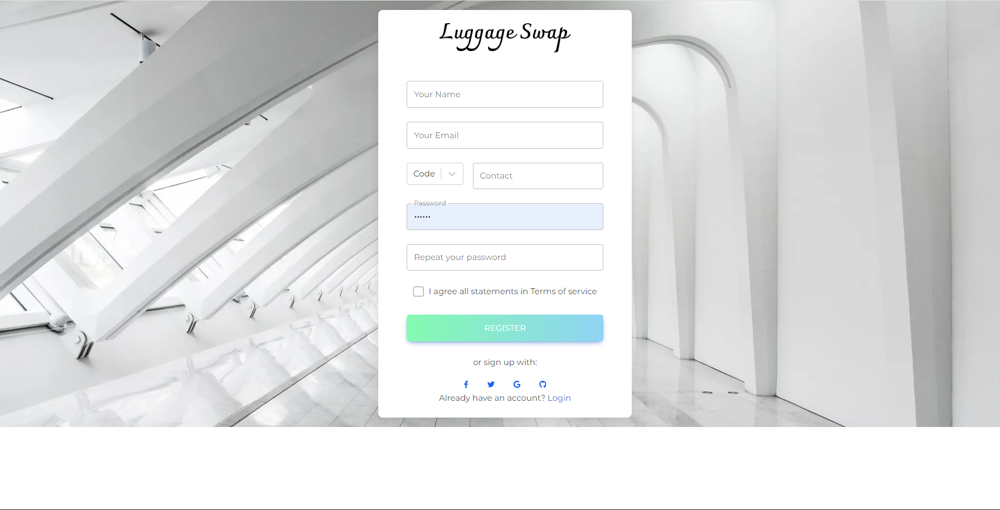
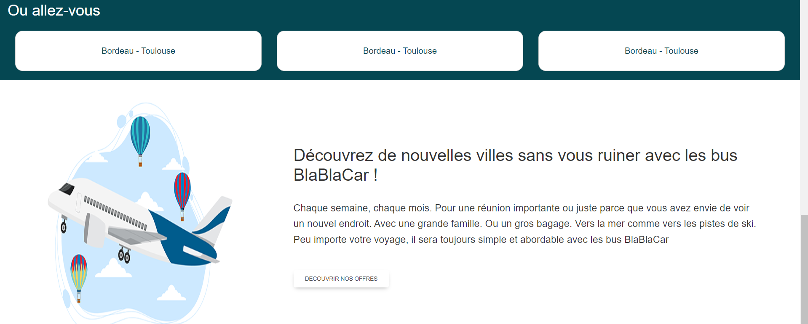
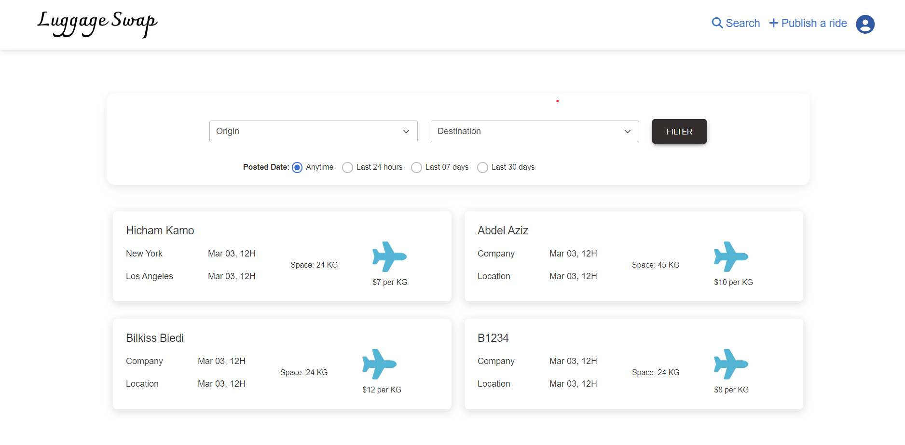

# Luggage Swap Website

Welcome to the Luggage Swap website repository! This project is built using React typeScript. The purpose of this website is to provide a platform where users can swap or trade their luggage items with others.

## Table of Contents

- [Introduction](#introduction)
- [Features](#features)
- [Technologies Used](#technologies-used)
- [Installation](#installation)
- [Usage](#usage)
- [Contact](#contact)
- [Screenshots](#screenshots)

## Introduction

Luggage Swap is a web application designed to facilitate the exchange of luggage items among users. Whether you have a suitcase you no longer need or are looking for a specific type of luggage, this platform allows you to list your items and connect with others for potential swaps.

## Features

- **User Authentication**: Secure login and registration system.
- **Item Listing**: Users can list their trips with the available weight they can take so that other users can make the reservation.
- **Search and Filter**: Advanced search functionality to find specific trips.
- **Messaging System**: Communicate directly with other users to negotiate swaps.
- **User Profiles**: View and manage your profile, including listed and swapped items.

## Technologies Used

- **React**: Frontend library for building user interfaces.
- **React Router**: For handling routing within the application.
- **Redux**: State management library for managing application state.
- **Firebase**: Backend-as-a-Service (BaaS) for user authentication and database.
- **CSS Modules**: For styling components in a modular and reusable way.
- **Axios**: For making HTTP requests.

## Installation

To get a local copy up and running, follow these simple steps:

1. **Clone the repository**:
   ```sh
   git clone https://github.com/aazizmegna/luggageswag-frontend.git
   ```

## Usage

1. **Start the development server**:

```sh
npm start
```

2. **Open http://localhost:3000 to view it in your browser**.

## Contact

azizoukamo@gmail.com

## Screenshots






